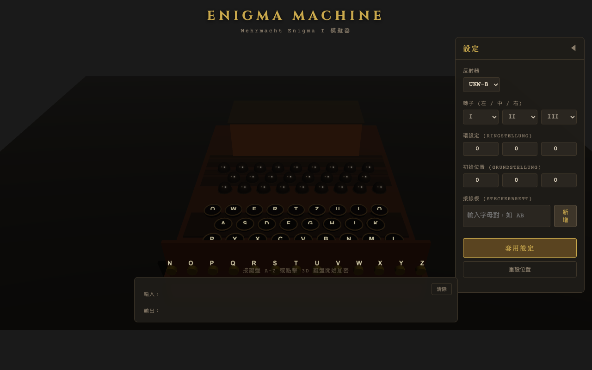

# Enigma Machine 互動式 3D 模擬器

二戰時期德國 Wehrmacht Enigma I 密碼機的互動式 3D 網頁模擬器。
完整實作歷史上的加密邏輯，包含轉子步進機制、反射器與接線板功能。

## 截圖

### 完整介面



### 3D 模型


## 功能特色

- 完整的 Enigma I 加密引擎，支援加密與解密
- 逼真的 3D 互動模型（Three.js 渲染）
- 5 種轉子可選（I、II、III、IV、V）
- 2 種反射器可選（UKW-B、UKW-C）
- 完整的接線板功能（Steckerbrett），最多 13 組配對
- 環設定（Ringstellung）與初始位置（Grundstellung）
- 雙步進機制（Double stepping anomaly）
- 即時加密結果顯示
- 支援實體鍵盤與 3D 滑鼠點擊雙重輸入
- 響應式設計，支援桌面與行動裝置

## 快速開始

### 前置需求

- [Docker](https://www.docker.com/)

### 啟動

```bash
bash run.sh
```

瀏覽器開啟 <http://localhost:8080> 即可使用。

### 停止

```bash
docker rm -f enigma-machine
```

## 操作說明

### 1. 設定轉子

在右側設定面板中：

1. **反射器**：從下拉選單選擇 UKW-B 或 UKW-C
2. **轉子**：為左、中、右三個位置各選擇一種轉子（I-V）
3. **環設定（Ringstellung）**：設定每個轉子的環偏移值（0-25）
4. **初始位置（Grundstellung）**：設定每個轉子的起始字母位置（0-25，對應 A-Z）

點擊「**套用設定**」按鈕使設定生效。

### 2. 設定接線板

接線板用於額外的字母交換，增加加密複雜度：

1. 在「接線板」欄位輸入兩個字母（如 `AB`）
2. 點擊「**新增**」或按 Enter 鍵
3. 配對會顯示在下方，點擊配對標籤可以移除
4. 最多可設定 13 組配對

也可以直接在 3D 模型的接線板上點擊插孔來建立配對。

### 3. 開始加密

有兩種輸入方式：

- **實體鍵盤**：直接按 A-Z 字母鍵
- **3D 滑鼠點擊**：點擊 3D 模型上的圓形按鍵

每按一個字母：

1. 3D 鍵盤按鍵會下沉動畫
2. 轉子自動旋轉
3. 燈板上對應的加密結果字母會亮起
4. 下方面板即時顯示輸入明文與輸出密文

### 4. 解密

Enigma 的特性是**自反性**——使用相同的設定，將密文再輸入一次即可還原明文。

1. 記下加密時的所有設定（轉子、位置、環設定、接線板）
2. 將設定重新調回加密前的狀態
3. 輸入密文，輸出即為原始明文

### 5. 其他操作

- **重設位置**：將轉子位置重設為初始位置（不清除設定）
- **清除**：清除輸入/輸出文字（不影響轉子狀態）
- **調整轉子**：點擊 3D 轉子上方的 ▲▼ 箭頭微調位置
- **旋轉視角**：滑鼠拖曳旋轉 3D 模型視角，滾輪縮放

## Enigma 加密原理

### 訊號路徑

```
鍵盤 → 接線板 → 右轉子 → 中轉子 → 左轉子 → 反射器
                                                ↓
燈板 ← 接線板 ← 右轉子 ← 中轉子 ← 左轉子 ←──┘
```

### 雙步進機制

Enigma 的轉子步進遵循以下規則：

1. **右轉子**：每次按鍵都會步進一格
2. **中間轉子**：當右轉子到達缺口位置時步進
3. **左轉子**：當中間轉子到達缺口位置時步進
4. **雙步進**：中間轉子在缺口位置時，下一次按鍵會同時帶動自身和左轉子步進

### 轉子缺口位置

| 轉子 | 缺口字母 |
|------|---------|
| I    | Q       |
| II   | E       |
| III  | V       |
| IV   | J       |
| V    | Z       |

## 專案架構

```
enigma/
├── README.md                        # 專案說明文件
├── LICENSE                          # MIT 授權
├── .gitignore                       # Git 忽略規則
├── run.sh                           # 啟動主程式腳本
├── docker/
│   ├── build.sh                     # 建置 Docker image
│   ├── Dockerfile                   # Docker 映像定義
│   └── nginx.conf                   # Nginx 設定
├── logs/                            # Log 存放目錄
├── screenshots/                     # 截圖目錄
│   ├── enigma-main.png              # 完整介面截圖
│   └── enigma-3d-model.png          # 3D 模型截圖
├── src/                             # 前端原始碼
│   ├── index.html                   # 主頁面
│   ├── css/
│   │   └── style.css                # 全域樣式
│   ├── js/
│   │   ├── main.js                  # 應用程式進入點
│   │   ├── enigma/                  # 加密引擎核心
│   │   │   ├── constants.js         # 轉子接線表、常數
│   │   │   ├── rotor.js             # 轉子類別
│   │   │   ├── reflector.js         # 反射器類別
│   │   │   ├── plugboard.js         # 接線板類別
│   │   │   └── enigma-machine.js    # 主機器類別
│   │   ├── three/                   # 3D 模型元件
│   │   │   ├── scene.js             # 場景設定
│   │   │   ├── enigma-model.js      # 模型主組裝
│   │   │   ├── keyboard-3d.js       # 3D 鍵盤
│   │   │   ├── lampboard-3d.js      # 3D 燈板
│   │   │   ├── rotors-3d.js         # 3D 轉子
│   │   │   ├── plugboard-3d.js      # 3D 接線板
│   │   │   └── materials.js         # 材質定義
│   │   └── ui/                      # UI 控制元件
│   │       ├── controls.js          # 設定面板
│   │       ├── input-handler.js     # 輸入處理器
│   │       └── display.js           # 文字顯示面板
│   └── assets/
│       └── textures/                # 材質貼圖（預留）
└── tests/
    └── enigma-core.test.html        # 核心邏輯單元測試
```

## 技術棧

- **3D 渲染**：[Three.js](https://threejs.org/) v0.172.0（CDN ES Module）
- **部署**：Docker + Nginx Alpine
- **前端**：純 HTML/CSS/JavaScript（無框架依賴）
- **字型**：Google Fonts（Cinzel、Courier Prime）

## 測試

開啟 `tests/enigma-core.test.html` 可在瀏覽器中執行核心邏輯單元測試，
測試項目包含：

- 轉子正反向映射
- 反射器自反性
- 接線板交換
- 完整加密路徑驗證（歷史已知密文）
- 雙步進機制
- 字母不會加密成自己

## 授權

MIT License
